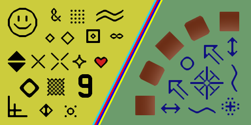

# hqx

## Description

hqx ("hq" stands for "high quality" and "x" stands for magnification) is one of the pixel art scaling algorithms developed by Maxim Stepin, used in emulators such as Nestopia, bsnes, ZSNES, Snes9x, FCE Ultra and many more. There are 3 hqx filters: hq2x, hq3x and hq4x which magnify by factor of 2, 3 and 4 respectively.

## Installation

```bash
git clone --recursive https://github.com/bernhardfritz/hqx.git
cd hqx
mkdir build
cd build
cmake ..
make
make install
```

## Usage

```
hqx [-s scaleBy] input output
```
## Example

```bash
hqx -s 4 test.png output.png
```





## References

* https://code.google.com/archive/p/hqx/
